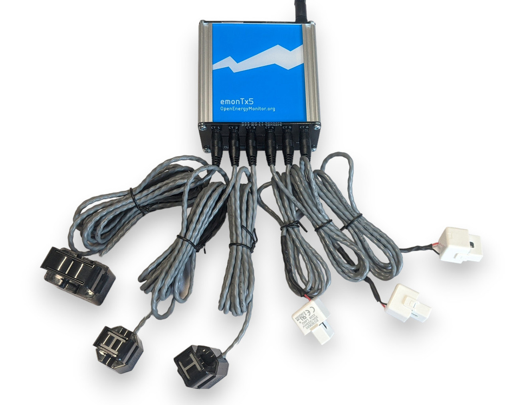

OpenEnergyMonitor EmonTx Sensors
================================

.. seo:: :description: Instructions for setting up OpenEnergyMonitor EmonTx energy monitors with ESPHome. :image: emontx.jpg :keywords: EmonTx, OpenEnergyMonitor, energy monitor, power monitoring, CT clamp

.. _emontx-component:

Component/Hub
-------------

The ``emontx`` component allows you to use an EmonTx device with ESPHome.
This component is a global hub that establishes the connection to the EmonTx via :ref:`UART <uart>` and translates the received data.
Using the :ref:`emontx sensors <emontx-sensor>`, you can then create individual sensors that track voltage, current, power, and temperature readings from the EmonTx.

    
    OpenEnergyMonitor EmonTx5.

As the communication with the EmonTx is done using UART, you need to have an :ref:`UART bus <uart>` in your configuration with the ``rx_pin`` connected to the data pin of the EmonTx and with the baud rate set to 115200.

.. code-block:: yaml

    # Example configuration entry
    uart:
      id: emontx_uart # using UART2
      rx_pin: GPIO16
      tx_pin: GPIO17
      baud_rate: 115200

    emontx:
      id: myemontx

Configuration variables
-----------------------

In `emontx` platform:

- **id** (*Optional*, :ref:`config-id`): Manually specify the ID used for code generation or multiple hubs.
- **uart_id** (*Optional*, :ref:`config-id`): Manually specify the ID of the UART Component if you want to use multiple UART buses.
- **emoncms** (*Optional*): For forwarding data to an `emoncms` server.

  - **emoncms_server** (**Required**): The URL of the emoncms server.
  - **api_key** (**Required**): The API write key for the emoncms server.
  - **node** (**Required**): The node ID to use for the emoncms server.
  - **http_id** (**Required**, :ref:`config-id`): The ID of the HTTP component to use for communication with the emoncms server.

.. note::

    If you configure the ``emoncms`` option, you will also need to define the ``http_request`` component in your configuration and reference its ID in the ``http_id`` parameter. This is required for the component to communicate with the emoncms server.
    
    For example:
    
    .. code-block:: yaml

        http_request:
          id: http_client
          useragent: esphome/emontx
          timeout: 10s
        
        emontx:
          emoncms:
            emoncms_server: "https://emoncms.org"
            api_key: YOUR_API_KEY
            node: 1
            http_id: http_client

.. _emontx-sensor:

Sensors
-------

The EmonTx component provides several sensors that can be used to monitor various parameters:

- **Power**: Calculates the power consumption based on the voltage and current readings.
- **Energy**: Accumulates the energy consumption over time.
- **Voltage**: Measures the voltage of the mains supply.
- **Current**: Measures the current flowing through the connected CT clamps.
- **Power Factor**: Calculates the power factor based on the voltage and current readings.
- **Pulse**: Measures the number of pulses from the connected pulse sensor (interface S0 for example).
- **Temperature**: Reports temperatures of connected Dallas DS18B20 sensors.

Predefined Sensor Configuration
*******************************
Each type of sensor in the EmonTx component has predefined configuration parameters:

Power Sensors (P)
^^^^^^^^^^^^^^^^^
Power sensors have the following default configuration:

- Unit of Measurement: W (Watt)
- Device Class: power
- State Class: measurement
- Accuracy: 1 decimal place

Energy Sensors (E)
^^^^^^^^^^^^^^^^^^
Energy sensors have the following default configuration:

- Unit of Measurement: Wh (Watt-hours)
- Device Class: energy
- State Class: total_increasing
- Accuracy: 3 decimal places

Voltage Sensors (V)
^^^^^^^^^^^^^^^^^^^
Voltage sensors have the following default configuration:

- Unit of Measurement: V (Volt)
- Device Class: voltage
- State Class: measurement
- Accuracy: 2 decimal places

Current Sensors (I)
^^^^^^^^^^^^^^^^^^^
Current sensors have the following default configuration:

- Unit of Measurement: A (Ampere)
- Device Class: current
- State Class: measurement
- Accuracy: 2 decimal places

Power Factor Sensors (PF)
^^^^^^^^^^^^^^^^^^^^^^^^^
Power factor sensors have the following default configuration:

- Unit of Measurement: (dimensionless)
- Device Class: power_factor
- State Class: measurement
- Accuracy: 2 decimal places

Temperature Sensors (T)
^^^^^^^^^^^^^^^^^^^^^^^
Temperature sensors have the following default configuration:

- Unit of Measurement: °C (Celsius)
- Device Class: temperature
- State Class: measurement
- Accuracy: 1 decimal place

Pulse Sensors (PULSE)
^^^^^^^^^^^^^^^^^^^^^
Pulse sensors have the following default configuration:

- Unit of Measurement: pulses
- Accuracy: 0 decimal places (whole numbers)

These predefined configurations can be overridden in your YAML configuration if needed.

Example of Sensor Configuration
*******************************
Here is an example of how to configure the EmonTx sensors in your ESPHome YAML configuration:

.. code-block:: yaml

    sensor:
      - platform: emontx
        tag_name: "V1"
        name: "Voltage L1"
      - platform: emontx
        tag_name: "V2"
        name: "Voltage L2"
      - platform: emontx
        tag_name: "V3"
        name: "Voltage L3"
      - platform: emontx
        tag_name: "P1"
        name: "Power CT1"
      - platform: emontx
        tag_name: "E2"
        name: "Energy CT2"
      - platform: emontx
        tag_name: "I3"
        name: "Current CT3"
      - platform: emontx
        tag_name: "pf1"
        name: "Power factor CT1"
      - platform: emontx
        tag_name: "T1"
        name: "Temp 1"
      - platform: emontx
        tag_name: "pulse"
        name: "Pulse"

Hardware Setup
--------------

The EmonTx can be connected to your ESP device via the serial UART interface.

Make sure the EmonTx is configured to output data in JSON format. The default baud rate for communication is 115200.

See Also
--------
- :ref:`sensor-filters`
- `OpenEnergyMonitor <https://openenergymonitor.org/>`_
- :ghedit:`Edit`
